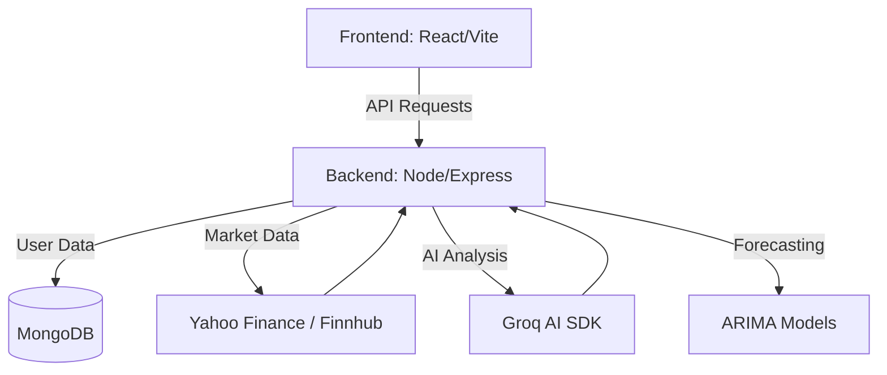

# 🚀 Stockify: Advanced AI Market Intelligence

[](https://reactjs.org/)
[](https://vitejs.dev/)
[](https://tailwindcss.com/)
[](https://nodejs.org/)
[](https://www.mongodb.com/)

**Stockify** is a high-performance, AI-driven stock market analysis platform designed for modern traders. It combines real-time data orchestration with advanced machine learning models to provide actionable insights, predictive forecasting, and deep market sentiment analysis.

---

## ✨ Key Features

### 🧠 AI-Driven Insights
- **Groq-Powered Intelligence**: Deep-dive analysis of stock performance using state-of-the-art LLMs.
- **Sentiment Analysis**: Real-time RSS news parsing with VADER sentiment scoring to gauge market mood.
- **Predictive Price Corridor**: Advanced ARIMA-based forecasting to visualize potential price movements.

### 📊 Precision Analytics
- **Live Market Data**: Seamless integration with Yahoo Finance and Finnhub for real-time price tracking.
- **Technical Indicators**: RSI, MACD, Moving Averages, and more, presented in beautiful interactive charts.
- **Global Indices**: Monitor major world markets (NIFTY, S&P 500, NASDAQ) in a single unified view.

### 💎 Premium User Experience
- **Glassmorphic UI**: A stunning, modern interface built with React, Tailwind CSS, and Framer Motion.
- **Dynamic Heatmaps**: Visualise sector performance with interactive treemaps.
- **Customizable Settings**: Tailor your experience with regional market selection (India, USA, etc.).

---

## 🛠️ Tech Stack

| Layer | Technologies |
| :--- | :--- |
| **Frontend** | React 18, Vite, Framer Motion, Recharts, Lucide React, Tailwind CSS |
| **Backend** | Node.js, Express, Mongoose |
| **AI/ML** | Groq SDK, ARIMA Forecasting, VADER Sentiment |
| **Data Sources** | Yahoo Finance API, Finnhub, RSS Feeds |
| **Database** | MongoDB Atlas |

---

## 🚀 Getting Started

### Prerequisites
- Node.js (v18+)
- MongoDB Atlas Account
- API Keys for Groq and Alpha Vantage

### Installation

1. **Clone the repository**
   ```bash
   git clone https://github.com/drv-01/Stockify.git
   cd Stockify
   ```

2. **Backend Setup**
   ```bash
   cd backend
   npm install
   # Create a .env file based on the provided template
   npm run dev
   ```

3. **Frontend Setup**
   ```bash
   cd ..
   npm install
   npm run dev
   ```

---

## 🏗️ Project Architecture



---

## 🎨 UI Preview

*Aesthetics matter. Stockify features a sleek dark mode with vibrant accent colors, smooth transitions, and high-density data visualizations.*

---

## 📄 License
Distributed under the MIT License. See `LICENSE` for more information.

---

<p align="center">
  Built with ❤️ for traders who want an edge.
</p>
